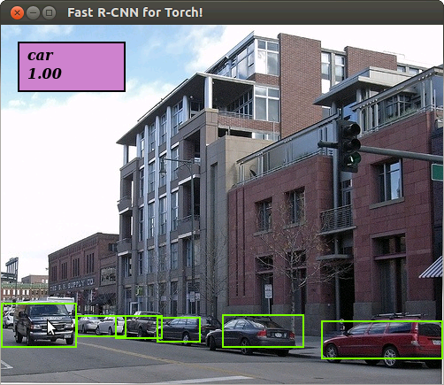

# Fast R-CNN example code

This example code showcases the use of the Fast R-CNN package for training and testing a network for object detection.


## Installation

### Requirements

- NVIDIA GPU with compute capability 3.5+ (2GB+ ram)
- [Torch7](http://torch.ch/docs/getting-started.html)
- [Fast-RCNN package](https://github.com/farrajota/fast-rcnn-torch)
- [dbcollection](https://github.com/farrajota/dbcollection)

### Packages/dependencies installation

To use this example code, some packages are required for it to work: `fastrcnn` and `dbcollection`.

#### fastrcnn

To install the Fast R-CNN package do the following:

- install all the necessary dependencies.

```bash
luarocks install tds
luarocks install cudnn
luarocks install inn
luarocks install matio
luarocks install torchnet
```

- download and install the package.

```bash
git clone https://github.com/farrajota/fast-rcnn-torch
cd fast-rcnn-torch && luarocks make rocks/*
```

> For more information about the `fastrcnn` package see [here](https://github.com/farrajota/fast-rcnn-torch).

#### dbcollection

To install the dbcollection package do the following:

- install the Python module.

    ```
    pip install dbcollection==0.1.7
    ```

    or

    ```
    conda install -c farrajota dbcollection==0.1.7
    ```

- install the Lua/Torch7 dbcollection wrapper:

    1. download the Lua/Torch7 git repo to disk.

    ```
    git clone https://github.com/dbcollection/dbcollection-torch7
    ```

    2. install the package.
    ```
    cd dbcollection-torch7 && luarocks make
    ```

> For more information about the dbcollection package see [here](https://github.com/dbcollection/dbcollection-torch7).


# Usage

To start using the code, clone this repo to your home directory:

```
git clone https://github.com/farrajota/fastrcnn-example-torch
```

If you clone the repo into a different directory, please make sure you modify `projectdir.lua` and point to the new path before using the code.

## Data setup

The necessary data is available for download by calling the following command in the terminal:

```bash
th download/download_all.lua
```

This will download the following data:

- pre-trained models on Imagenet
- pre-processed roi proposals on the caltech pedestrian dataset
- annotations in the COCO format for evaluating the network accuracy using the 'coco' evaluation protocol.


> Note: this data can also be downloaded manually by following the next steps.


### Pre-trained models

Several pre-trained models are available to be used in this example code. To download these networks, simply run the following command in the terminal (assuming you are in the root dir of the repo):

```bash
th download/download_pretrained_models.lua
```

This will download the following network types pretrained on the ImageNet ILSVRC2012 dataset: alexnet, zeilernet, googlenet, vgg and resnet

### RoI Proposals

To download the roi proposals, simply run the following command in the terminal (again, assuming you are in the root dir of the repo):

```bash
th download/download_roi_proposals.lua
```

### Datasets

To run the example code, the user can let the script handle the data download and setup.

However, if the user already has downloaded the data to disk, it is advisable to manually setup the dataset before runing the script to avoid downloading the data to disk.

To do this you can do the following:

```lua
dbc = require 'dbcollection.manager'
dbc.add{name='pascal_voc_2007', data_dir='path/to/dataset', task={}, file_path={}}
```

Even if you don't have the dataset, it is best to manually setup the dataset because this way you can specify the path where data will be stored on disk. Like the previous example, to setup a dataset's data you simply need to do the following:

```lua
dbc = require 'dbcollection.manager'
dbc.load{name='pascal_voc_2007', data_dir='save/dir/path'}
```

> Note: If no path is provided, the dataset will be stored in the `~/dbcollection/<dataset_name>/data/` directory in your home path.

#### Available datasets

The following datasets are available for training/testing an object detector using this repo:

- [Pascal VOC 2007](http://host.robots.ox.ac.uk/pascal/VOC/voc2007/index.html)
- [Pascal VOC 2012](http://host.robots.ox.ac.uk/pascal/VOC/voc2012/index.html)
- [Microsoft COCO](http://mscoco.org/)

> Note: For a list of all available datasets fro train/test check `options.lua`.


## Train and test a model using the example code

This repository contains scripts for training and testing an object detector network using a pre-trained network on ImageNet for feature extraction such as the alexnet or resnet.

> Note: several options are available for configuring the training/testing parameters (see `options.lua` for a complete set of available parameters).


### Training a network

To train a model run `th train.lua`. To change the default settings, use the input arguments of your choice. To see all available option's parameters do `th train.lua --help` or check `options.lua`.

* You can select one of the following imagenet pre-trained networks for feature extraction: AlexNet, ZeilerNet, VGG (16, 19), ResNet (19, 34, 50, 101, 152, 200), and GoogleNet v3.

* Snapshots of the network's training procedure are stored to disk other information such as the configuration file, loss logs and model parameters of the training procedure (default path is `./data/exp`). You can change this directory by passing the `-expDir`new path to save the experiment option.


### Testing a network (mAP accuracy)


To test a network's accuracy, run `th test.lua` and define the `-expID`, `-dataset` and `-expDir` input options (if changed) to compute the mean average-precision.

> Note: Network evaluation (test) only uses a single GPU for inference.


### Scripts

In the `scripts/` folder there are several pre-configured example scripts for training and testing a network. To run a script just call them  like this:

```
th scripts/train_test_alexnet_voc2007.lua
```

### Running the demo

To run the basic demo code you'll first need to train a network model. After this is done, just simply run the demo on the terminal:

```lua
qlua demo.lua -expID <exp_name> -dataset <dataset_name>
```

After running the demo you should see something like this:



> Note: This image was taken from this [repo](https://github.com/mahyarnajibi/fast-rcnn-torch). In the demo script a random image is selected from the test set and displayed. To change the generated image just modify the `-manualSeed` value.


# License

MIT license (see the LICENSE file)
